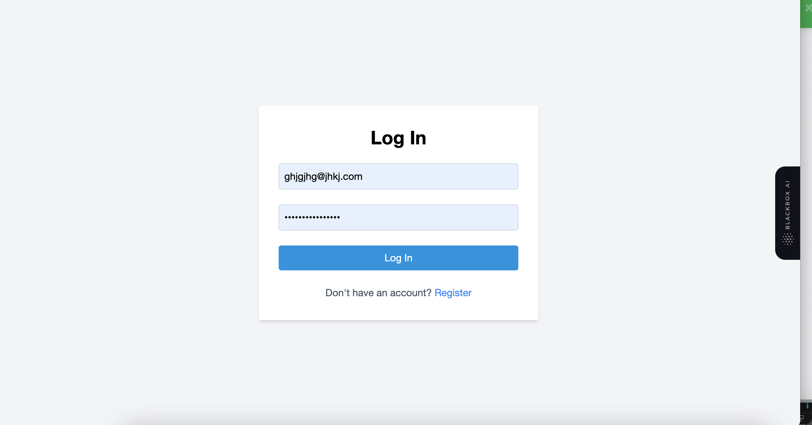
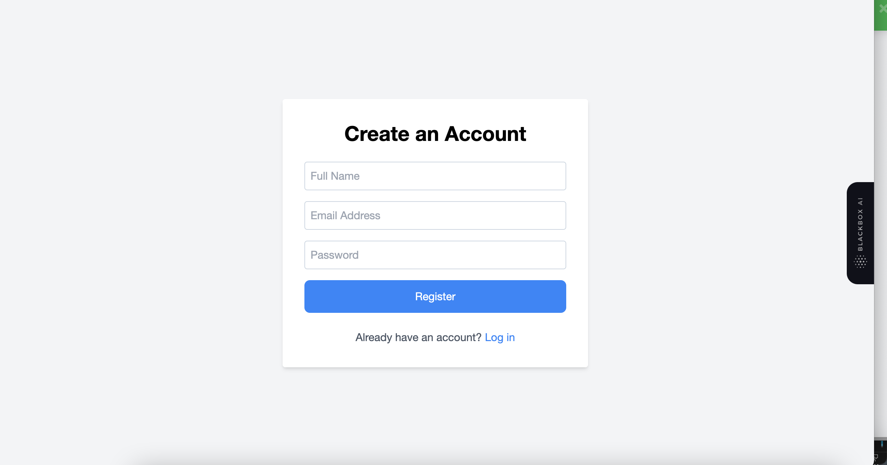
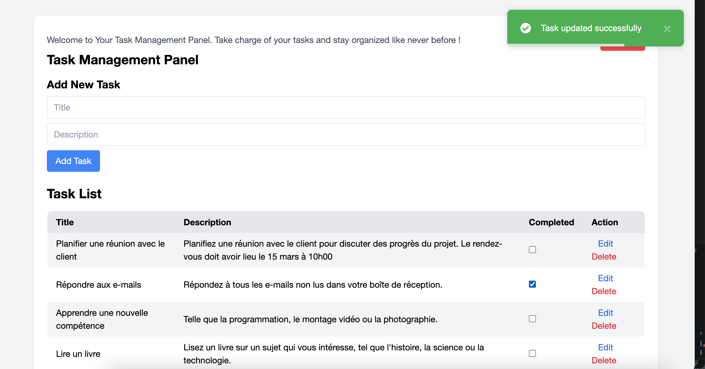
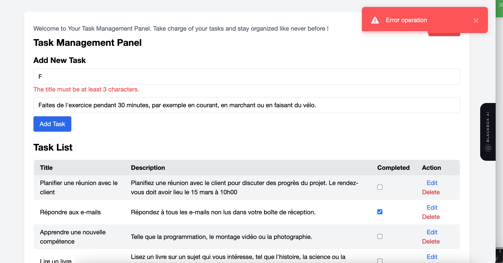

# Frontend Project - Task Manager

This project is the frontend part of a task management application, built with Vue.js. Users can create and manage tasks using this application.

## Prerequisites

- Node.js and npm must be installed on your system.

## Installation Instructions

1. Clone this repository to your local machine.
2. Navigate to the project directory: `cd path/to/your/frontend/project`
3. Install dependencies: `npm install`
4. Start the application: `npm run serve`

The application should now be accessible at http://localhost:8080 in your browser.

## Key Features

- Vue.js for building the user interface.
- Integration with the backend API to manage tasks.
- Adding, editing, deleting, updating, and marking tasks as completed.
- User authentication using JWT for secure access.
- User-friendly interface with Tailwind CSS.

## Complete Documentation

To learn more about the features and usage of the frontend application, please refer to the [complete documentation](link/to/your/documentation).
